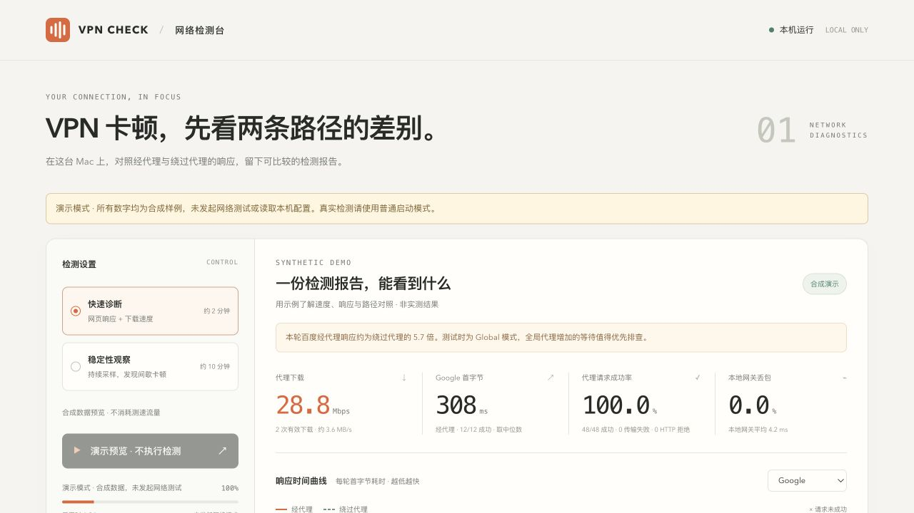

<div align="center">


# VPN Check

**Slow proxy connection? Compare the two paths.**

A local macOS dashboard for paired proxy/bypass requests, download samples, and response-time stability.

[中文](README.md) · [Quick start](#quick-start) · [Try the demo](#try-the-demo)

</div>



*The screenshot contains synthetic example data, not a benchmark or a user's network records. The dashboard currently uses Chinese labels.*

## What you can investigate

- Compare the same website through your proxy and with HTTP/SOCKS proxy settings bypassed.
- Watch response-time variation and separate transport failures from HTTP rejections.
- Change nodes manually, rerun a check, and inspect timestamped local reports.

Python standard library + macOS curl. No pip, npm, Docker, account or build step required. Reports stay local; measurements contact public test websites.

## Quick start

Requires **macOS, Python 3.10+, and an active local proxy**. The dashboard automatically detects Clash Verge or a local HTTP proxy configured in macOS. Custom ports can be supplied to the CLI.

```bash
git clone https://github.com/rzr002/vpn-check.git
cd vpn-check
python3 web_server.py --open
```

Click **开始检测** (“Start check”) at `http://127.0.0.1:8876`. Keep the server terminal open. The Finder launcher is `打开检测面板.command`; terminal startup is also available if macOS blocks the downloaded script.

| Mode | Measurements | Duration / traffic |
| --- | --- | --- |
| Quick check | 4 sites × 2 paths × 12 rounds, downloads and gateway ping | Usually 1–4 minutes; 40 MiB of download-test payload plus web probes |
| Stability observation | 60 rounds of paired web probes | Around 10 minutes, longer with slow requests; no download test |

Stop at any time. Reloading the browser keeps the running test intact. Completed JSON/Markdown reports are saved under `reports/`; partial samples can be exported from the UI.

## Try the demo

```bash
python3 web_server.py --demo --port 8877 --open
```

The demo uses deterministic synthetic data. It does not read proxy configuration, real reports or perform measurements. A visible banner labels the example and the start button is disabled. Omit `--demo` to run real checks.

## Interpret carefully

- Download figures are single-connection samples to Cloudflare, including connection overhead; they are not maximum line capacity.
- Time to first byte includes connection setup, TLS and server processing. It is not ping RTT.
- HTTP failures are not packet loss. Gateway ICMP loss is not VPN-node or UDP loss.
- Bypassing proxy settings does not bypass a TUN/system tunnel. A proxy request may still be routed DIRECT by rules.
- Node observations sample active connections for a hostname and may include requests from other apps.
- A short successful run does not establish long-term stability. Upload, loaded latency and continuous monitoring are not implemented.

The tool presents evidence and limited hints; it does not establish a root cause automatically or change your proxy settings.

## CLI

```bash
python3 vpn_check.py --proxy http://127.0.0.1:7897
python3 vpn_check.py --proxy socks5h://127.0.0.1:1080
python3 vpn_check.py --rounds 60 --interval 10 --download-mib 0
```

[Privacy and report contents](docs/privacy.md) · [Detailed Chinese guide](docs/usage.md) · [Contributing](CONTRIBUTING.md)

## Development

```bash
python3 -m unittest discover -s tests -v
```

Native HTML/CSS/JavaScript; no frontend build. CI runs tests and syntax checks without contacting public measurement endpoints. The measurement backend targets macOS.

[MIT License](LICENSE). Not a VPN provider, or an official Clash or Cloudflare project.
