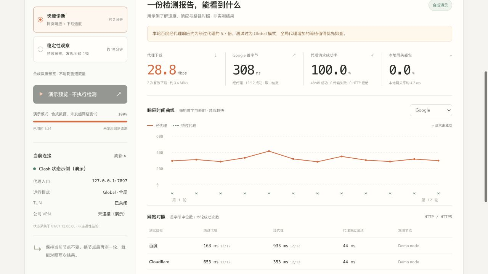

<div align="center">


# VPN Check

**VPN 卡顿，先看两条路径的差别。**

在 Mac 上一键对照「经代理」与「绕过代理」的网页响应、下载速度和短时稳定性。

[开始检测](#开始检测) · [先看演示](#先看演示) · [完整指南](docs/usage.md) · [English](README.en.md)


[](https://github.com/rzr002/vpn-check/actions/workflows/tests.yml)
[](LICENSE)

</div>


*界面预览使用合成数据，不是测速成绩，也不包含真实用户网络信息。*

## 从「感觉卡」到一份可比较的报告

- **国内网站也变慢？** 同一轮分别走代理和绕过代理，看等待时间差在哪。
- **有时快、有时卡？** 用响应曲线观察波动，分别记录连接失败和 HTTP 拒绝。
- **换节点到底有没有用？** 手动切换后重测，回看带时间戳的报告，导出 JSON 留存。

使用 Python 标准库与系统 curl，无需 `pip install`、Node.js 或 Docker。无需注册，报告保存在本机。检测会访问公开测试网站。

## 开始检测

需要 **macOS、Python 3.10+、已开启的本地代理**。网页模式自动识别 Clash Verge 或 macOS 已配置的本机 HTTP 代理；其他端口可通过命令行指定。

```bash
git clone https://github.com/rzr002/vpn-check.git
cd vpn-check
python3 web_server.py --open
```

浏览器打开 `http://127.0.0.1:8876` 后，点击 **开始检测**。保留启动服务的终端窗口。

也可以在 Finder 双击 **`打开检测面板.command`**。如果系统拦截下载的脚本，使用上面的终端启动命令即可，无需调整系统安全设置。

| 模式 | 你会得到什么 | 时间与流量 |
| --- | --- | --- |
| 快速诊断 | 4 个网站 × 2 条路径 × 12 轮；下载测速与网关检查 | 通常 1–4 分钟；下载测试目标共 40 MiB，另有网页流量 |
| 稳定性观察 | 60 轮网页采样，观察间歇失败与响应波动 | 约 10 分钟，慢请求可能延长；不执行下载测速 |

检测可以中途停止，刷新网页不会中断检测。完整报告自动保存在 `reports/`；中断后的部分样本可从页面导出。

## 先看演示

没有配置代理，也能先看看结果长什么样：

```bash
python3 web_server.py --demo --port 8877 --open
```

演示模式仅使用合成数据，不读取本机代理配置、真实历史报告或发起测速。页面明确标注「演示模式」，检测按钮禁用。真实检测请去掉 `--demo`。

<details>
<summary>展开查看响应曲线与网站对照（合成演示）</summary>



</details>

## 读懂结果，再决定下一步

| 观察到的现象 | 下一步可以检查 |
| --- | --- |
| 国内网站经代理明显更慢 | 当前是否为 Global 模式，国内流量是否绕行了海外节点 |
| 经代理成功，绕过代理失败 | 目标可能依赖代理访问；结合报错区分连接失败与网站拒绝 |
| 下载不低，但响应曲线频繁升高 | 在卡顿时运行更长的稳定性观察，对照不同网站与节点 |
| 本地网关也出现丢包或高延迟 | 先检查本地连接，并考虑网关是否限制 ICMP |

这些结果提供排查线索，不自动确定根因。工具不会切换节点或修改 DNS、路由、订阅。

<details>
<summary><b>测量范围：这些数字能证明什么？</b></summary>

- **下载速度**：到 Cloudflare 的单连接平均值，包含连接开销，不是最大带宽；只有完整成功下载才计入。
- **首字节响应**：包含连接、TLS 和网站处理，不等于 ping RTT；相邻响应波动不等于网络 RTT jitter。
- **请求成功率**：HTTP 2xx/3xx 计成功，不验证整页资源或登录；请求失败率不是丢包率。
- **网关丢包**：20 个本地 ICMP 样本，不代表 VPN 节点或 UDP 丢包。
- **路径对照**：绕过 HTTP/SOCKS 代理仍可能被 TUN 接管；经 Clash 入口也可能被规则分流为 DIRECT。
- **观测节点**：来自对应域名的活跃连接采样，可能包含其他应用请求；未捕获保持未知。
- **稳定性**：只反映本次采样窗口。暂不支持上传测速、负载下延迟或全天监控。

</details>

## 进一步使用

- [完整指南、命令行参数与常见问题](docs/usage.md)
- [数据与隐私范围](docs/privacy.md)
- [参与开发](CONTRIBUTING.md) · [版本记录](CHANGELOG.md)

只需要自定义代理端口时：

```bash
python3 vpn_check.py --proxy http://127.0.0.1:7897
python3 vpn_check.py --proxy socks5h://127.0.0.1:1080
```

## 开发与许可

```bash
python3 -m unittest discover -s tests -v
```

测量后端面向 macOS。前端是原生 HTML/CSS/JavaScript，无构建步骤。CI 会检查 Python 测试、JavaScript 语法和启动脚本；测试不连接公开测速站。

[MIT License](LICENSE) · 本工具不是 VPN 服务商，也不是 Clash 或 Cloudflare 的官方项目。
